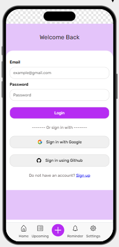
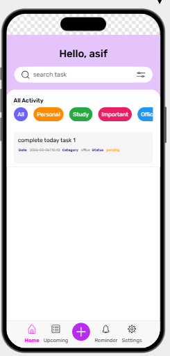
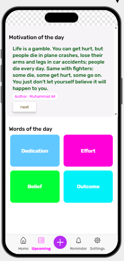
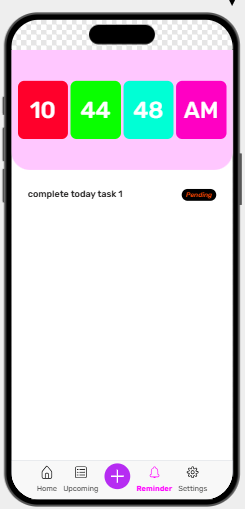
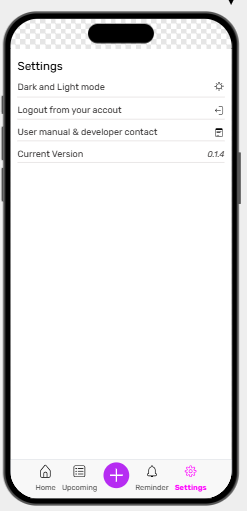
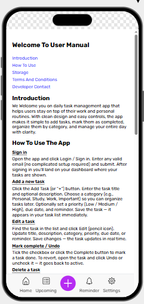
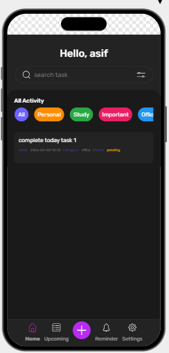

# Daily Task Management App

**Daily Task Management App** is a simple and user-friendly to-do application built with **React.js** that helps users organize their daily tasks efficiently.  
All tasks are stored locally using **Browser Local Storage**, so your data remains safe even after refreshing the page.










## Features

- Add new daily tasks
- Edit & update existing tasks
- Delete tasks
- Mark tasks as completed
- Manage daily goals in a clean UI
- Persistent data using **Local Storage**
- **Motivational Quotes** fetched from an external API
- Fast and responsive React-based interface

---

## Tech Stack

- **Frontend:** React.js
- **State Management:** React Hooks
- **Storage:** Browser Local Storage
- **API Integration:** Motivational Quotes API
- **Styling:** CSS / SCSS (based on your implementation)

---

## Project Structure

```text
daily-task-management/
│
├── src/
│   ├── components/
│   ├── hooks/
│   ├── utils/
│   ├── App.js
│   └── index.js
│
├── public/
├── package.json
└── README.md
```

---

## How It Works

- Users can create and manage daily tasks easily.
- Tasks are saved in **localStorage**, ensuring data persistence without a backend.
- Completed tasks can be marked visually.
- A motivational quote is fetched from an API to keep users inspired throughout the day.

---

## Installation & Setup

1. Clone the repository:

```bash
git clone https://github.com/asifmeer55766/daily-task-management.git
```

2. Navigate to the project directory:

```bash
cd daily-task-management
```

3. Install dependencies:

```bash
npm install
```

4. Start the development server:

```bash
npm start
```

---

## Future Enhancements

- Task reminders & notifications
- Task progress analytics
- Dark mode support
- Cloud-based data storage
- User authentication

---

## Contributing

Contributions are welcome!
Feel free to fork the repository and submit a pull request.

---

## License

This project is open source and available under the **MIT License**.

---

## Author

**Asif Hussain**
Frontend Developer | React.js Enthusiast

---

If you like this project, don’t forget to **star** the repository!
